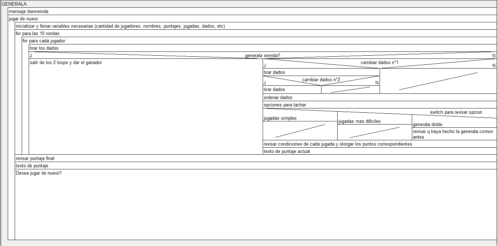

# Generala en Java (Swing / JOptionPane)

Juego interactivo de la **Generala tradicional** para múltiples jugadores desarrollado en Java, con interfaces gráficas modales mediante `javax.swing.JOptionPane` y soporte de recursos visuales.

---

## 🎮 Características principales

* **Soporte multijugador:** Permite ingresar la cantidad dinámica de participantes y registrar sus respectivos nombres.
* **Mecánica completa de lanzamientos:**
  * Hasta 3 tiros por turno.
  * Selección manual de dados a conservar o relanzar (notación `a`, `b`, `c`, `d`, `e`).
* **Lógica oficial de puntuación:**
  * **Generala Servida:** Detección automática en primera tirada que da por ganada la partida.
  * **Juegos mayores:** Escalera (20 pts), Full (30 pts), Poker (40 pts) y Generala (50 pts), con bonificación de +5 puntos si son servidos.
  * **Generala Doble:** Validación de 100 puntos si el jugador ya anotó una Generala previa, permitiendo tachar una categoría adicional.
  * **Juegos de números:** Sumatoria del 1 al 6 según cantidad de repeticiones.
* **Tablero dinámico de puntos:** Seguimiento por ronda y acumulado visible para cada jugador.
* **Pantalla de victoria:** Detección automática del mayor puntaje y entrega de trofeo final.

---

## 📐 Diseño y Lógica de Flujo

La estructura algorítmica previa a la codificación fue modelada mediante un diagrama Nassi-Shneiderman:



---

## 🛠️ Tecnologías utilizadas

* **Lenguaje:** Java (JDK 8 o superior)
* **GUI / Interfaz:** Java Swing (`JOptionPane`, `ImageIcon`)
* **Entorno de desarrollo:** Eclipse IDE

---

## 🚀 Cómo ejecutar el proyecto

### Opción 1: En un IDE (Eclipse, IntelliJ IDEA, NetBeans)
1. Cloná o descargá el repositorio en formato ZIP.
2. Abrí tu entorno de desarrollo y seleccioná **Import / Open Project**.
3. Ejecutá la clase principal: `src/generala/Generala.java`.

### Opción 2: Desde la terminal
1. Clonar el repositorio:
   ```bash
   git clone [https://github.com/Matias-Vallejos/generala-java.git](https://github.com/Matias-Vallejos/generala-java.git)
   cd generala-java

> 🎓 Contexto académico: Proyecto desarrollado para la materia Programación Orientada a Objetos (2do Parcial) — Carrera de Analista de Sistemas.
